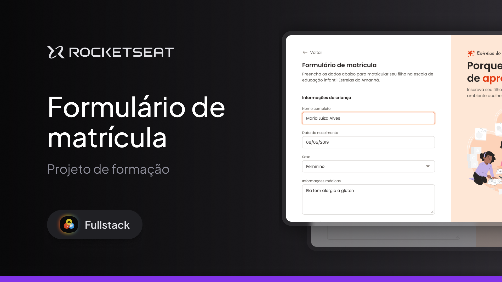

<h1 align="center"> Desafio Portal de Noticias</h1>

Acompanhamento pratico da trilha Full-Stack, promovido pela Rocketseat para ensino de tecnologias WEB.  

  <a href="#-tecnologias">Tecnologias</a>&nbsp;&nbsp;&nbsp;|&nbsp;&nbsp;&nbsp;
  <a href="#-projeto">Projeto</a>&nbsp;&nbsp;&nbsp;|&nbsp;&nbsp;&nbsp;
  <a href="#-layout">Layout</a>&nbsp;&nbsp;&nbsp;|&nbsp;&nbsp;&nbsp;
  <a href="#memo-licença">Licença</a>

  

 

  

## 🚀 Tecnologias

Desenvolvendo habilidade em formulario

- HTML e CSS
  - ESTRUTURA DE FORMULARIO
  - INPUTS
  - BOTÕES DO FORMULARIO
  - flexbox
  - grid
  - position
  - Variavel CSS
  - Seletores
- Organização
- Git e Github
- Figma

## 💻 Projeto

- [Visite o projeto online](https://kelvingomes13.github.io/FORMULARIO-DE-MATRICULA/)

## 🔖 Layout

Você pode visualizar o layout do projeto através [DESSE LINK](https://www.figma.com/community/file/1365016793556649696). É necessário ter conta no [Figma](https://figma.com) para acessá-lo.

## Licença

Esse projeto está sob a licença MIT.

---

Feito com ♥ by Rocketseat

